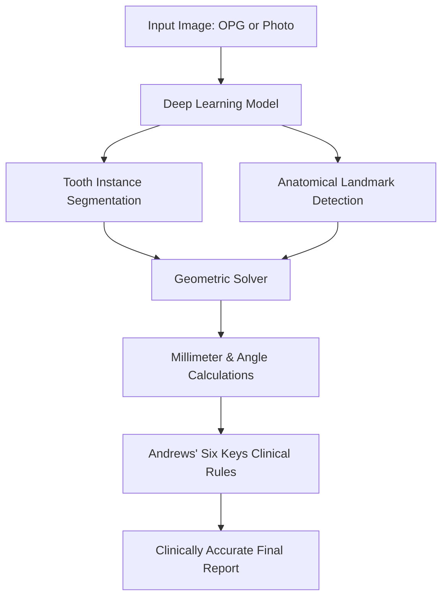
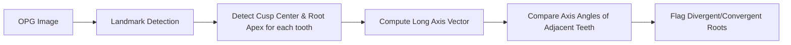

# Technical Guide: Building Clinically Accurate Orthodontic AI Pipelines

This document provides a comprehensive technical blueprint and guide for upgrading the **OrthofinixAI** platform from basic computer vision approximations to a clinically reliable, measurement-based orthodontic finishing assessment system.

---

## 1. Root Causes of Current Inaccuracies

The current implementation of the backend relies on general image processing (adaptive thresholding, Canny edge density, and bounding box contours) on a 2D projection. In clinical orthodontics, these heuristics fail for several reasons:

* **Overlapping Contours:** Bounding boxes of overlapping or rotated teeth merge, causing incorrect width and spacing calculations.
* **Lack of Root Visibility in Intraoral Photos:** Root angulation and parallelism cannot be inferred from intraoral photographs; they require panoramic radiographs (OPGs) or CBCT scans.
* **Scale Invariance (Pixels vs. Millimeters):** The app cannot measure overjet or overbite in millimeters without a calibration reference (e.g., a known bracket width or calibration marker).
* **Andrews' Six Keys Requirements:** Keys like crown inclination (torque) and crown angulation (tip) require specific anatomical landmarks (e.g., the FA point, the long axis of the clinical crown, and the occlusal plane). Simple contour coordinates cannot represent these.

---

## 2. Recommended Computer Vision & Deep Learning Models

To achieve clinical-grade accuracy, we must replace generic contour detection with targeted, state-of-the-art architectures:

### A. Dental Landmark Detection (Keypoint Regression)
Cephalometric and dental landmark detection requires high spatial precision.
* **HRNet (High-Resolution Net):** The gold standard for keypoint detection. Unlike UNet or ResNet, HRNet maintains high-resolution representations throughout the network, preserving spatial precision for landmarks (like the incisal edges, molar cusps, or root apices).
* **YOLOv8-Pose:** Excellent for real-time landmark detection on mobile devices or server-side fast inference. You can train YOLOv8-pose to detect individual tooth bounding boxes while predicting key points (such as crown center, root apex, and cusp tips).

### B. Tooth Segmentation
To measure marginal ridge alignment, rotation, and contours, we must segment each tooth individually (instance segmentation).
* **MedSAM (Medical Segment Anything Model):** A fine-tuned version of Meta's Segment Anything Model specialized for medical and dental imaging. It works remarkably well on OPGs and intraoral photos.
* **Mask R-CNN / YOLOv8-Seg:** Used to segment individual teeth and classify them according to the FDI World Dental Federation notation (e.g., Tooth 11, 21, 31, 41).

### C. 3D Intraoral Scan Analysis (STL/OBJ files)
If processing 3D models:
* **PointNet++ / Dynamic Graph CNN (DGCNN):** Deep learning architectures that operate directly on 3D point clouds/meshes to perform tooth segmentation and calculate precise 3D angulation and torque vectors.

---

## 3. Orthodontic Clinical Calculations: Mathematical Formulations

Rather than using machine learning to predict final diagnostics directly (which acts as a "black box" and is prone to errors), use the **Hybrid AI Pattern**:
1. **AI Component:** Detects coordinate points (landmarks) and segmentations.
2. **Clinical Rules Component:** Computes geometric distances, angles, and ratios using orthodontic formulas.

### A. Overjet and Overbite Calculation
To calculate overjet (horizontal distance) and overbite (vertical overlap) from a lateral view or lateral cephalogram:

1. **Define the Occlusal Plane (OP):** A line passing through the occlusion of the first molars and the incisal edges.
2. **Identify Landmarks:**
   - $U_i$: Incisal edge of the maxillary central incisor.
   - $L_i$: Incisal edge of the mandibular central incisor.
   - $L_l$: Most anterior/labial point on the mandibular central incisor.
3. **Project Coordinates:**
   - Project the vector $\vec{v} = U_i - L_l$ onto the occlusal plane vector $\vec{u}_{op}$.
   - **Overjet (OJ):** The horizontal projection.
     $$OJ = | \vec{v} \cdot \vec{u}_{op} | \times \text{Calibration Factor}$$
   - **Overbite (OB):** The vertical overlap. Project the vector $U_i - L_i$ onto the normal of the occlusal plane $\vec{n}_{op}$.
     $$OB = | (U_i - L_i) \cdot \vec{n}_{op} | \times \text{Calibration Factor}$$

### B. Molar Relationship (Andrews' Key 1)
To classify molar relationships (Class I, II, or III) from a lateral intraoral photo:

1. **Locate Key Cusp & Groove Landmarks:**
   - $C_{max}$: The tip of the mesiobuccal cusp of the maxillary first molar (Tooth 16 or 26).
   - $G_{mand}$: The buccal groove of the mandibular first molar (Tooth 36 or 46).
2. **Determine Occlusal Vector:**
   - Establish the local occlusal plane direction vector $\vec{u}_{op}$ (pointing posterior-to-anterior).
3. **Calculate Disparity ($D$):**
   - Project the displacement vector $\vec{d} = C_{max} - G_{mand}$ onto $\vec{u}_{op}$:
     $$D = \vec{d} \cdot \vec{u}_{op}$$
4. **Classification Logic:**
   - **Class I:** $|D| \leq 1.5\text{ mm}$ (Maxillary cusp fits directly into the mandibular groove).
   - **Class II:** $D > 1.5\text{ mm}$ (Maxillary cusp is anterior to the mandibular groove).
   - **Class III:** $D < -1.5\text{ mm}$ (Maxillary cusp is posterior to the mandibular groove).

### C. Crown Angulation (Key 2 - Tip) & Inclination (Key 3 - Torque)
* **Crown Angulation (Tip):** The angle between the long axis of the clinical crown (line passing through the FA point and parallel to the mid-developmental ridge) and a line perpendicular to the occlusal plane.
  $$\theta_{tip} = 90^\circ - \text{angle}(\text{Crown Axis}, \text{Occlusal Plane})$$
* **Crown Inclination (Torque):** The angle between a line tangent to the middle third of the labial clinical crown (tangent at the FA point) and a line perpendicular to the occlusal plane. Measured on profile photos/lateral cephalograms.

---

## 4. OPG (Panoramic Radiograph) Analysis: Root Parallelism

Root parallelism is evaluated during orthodontic finishing to ensure roots are upright and parallel, preventing relapse.

### Protocol for Root Parallelism Evaluation:
1. **Identify the Long Axis of Adjacent Teeth:**
   - For each tooth $i$, locate the crown center $C_i$ and the root apex $R_i$.
   - The root/tooth vector is $\vec{a}_i = C_i - R_i$.
2. **Compute Adjacent Angles:**
   - Calculate the angle $\phi_i$ between $\vec{a}_i$ and the occlusal plane.
   - Compare adjacent teeth:
     $$\Delta\theta = |\phi_i - \phi_{i+1}|$$
3. **Clinical Evaluation:**
   - **Parallel:** $\Delta\theta \leq 5^\circ$
   - **Divergent/Convergent (Uprighting Required):** $\Delta\theta > 5^\circ$ (recommend specific artistic or tipping bends in bicuspid/molar regions).

---

## 5. System Calibration (Pixel-to-Millimeter Conversion)

To output exact measurements in millimeters (e.g., "Overjet: 2.3 mm" instead of "Slight anterior overjet"), the application needs to calibrate the pixel dimensions.

### Recommended Calibration Approaches:
1. **Known Bracket Dimension (Clinical Standard):**
   - Most patients have orthodontic brackets of standard sizes (e.g., Roth/MBT brackets are usually $3.0\text{ mm}$ or $3.2\text{ mm}$ wide).
   - Have the AI detect the bracket contour, measure its width in pixels ($W_{pixel}$), and compute the scale factor:
     $$\text{Calibration Factor} = \frac{\text{Bracket Width (mm)}}{W_{pixel}}\text{ mm/pixel}$$
2. **Fiducial Markers:**
   - Instruct the doctor to place a standard-sized physical circular adhesive marker (e.g., $5.0\text{ mm}$ diameter dot) on the cheek or cheek retractor before taking the intraoral photo.
3. **Sensor-to-Distance Estimations:**
   - Using TrueDepth / LiDAR sensors on modern mobile devices to capture the depth plane of the teeth, allowing direct spatial reconstruction.

---

## 6. How to Reduce False Detections

To avoid false detections (like showing anterior overjet when none is present):

* **Anatomical Constraint Filters (Heuristics):**
  Implement validation checks. For example, lower teeth must always reside inferiorly to upper teeth, and the tooth sequence from left to right must follow anatomical rules (e.g., Central Incisor $\rightarrow$ Lateral Incisor $\rightarrow$ Canine $\rightarrow$ Premolar $\rightarrow$ Molar).
* **RANSAC Occlusal Plane Fitting:**
  Instead of defining the occlusal plane by connecting arbitrary points, use RANSAC (Random Sample Consensus) to fit a smooth quadratic curve or straight line through all detected occlusal contacts. This ignores misaligned or outlier landmark detections.
* **Confidence Gating:**
  If the landmark model confidence for a specific tooth is below 75%, trigger a fallback warning requesting image recapture, rather than calculating faulty measurements.

---

## 7. Recommended Datasets & Research Papers

### Datasets
* **ISBI Cephalometric Landmark Detection Dataset:** The benchmark dataset containing lateral cephalometric radiographs with expert-annotated landmark coordinates.
* **UFBA_UESC Dental Image Dataset:** Contains intraoral images annotated for tooth segmentation and classification.
* **Panoramic Radiograph Dataset (e.g., Tufts Dental Database):** Large dataset of OPG images labeled for tooth segmentation, numbering, and root pathology.

### Key Research Papers
1. *Andrews, L. F. (1972). "The six keys to normal occlusion." American Journal of Orthodontics.* (Crucial for the clinical rules).
2. *Wang, L., et al. (2021). "Evaluation of deep learning-based auto-segmentation of teeth on panoramic radiographs." Scientific Reports.*
3. *Gupta, A., et al. (2020). "Cephalometric landmark detection using high-resolution networks (HRNet)." IEEE Transactions on Medical Imaging.*

---

## 8. Refactoring Plan for OrthofinixAI

To bridge the gap between current mock statistics and real, measurement-based outputs:

### Step 1: Update API Contracts & Schema
Modify `schemas.py` to support full coordinate data, actual millimeter measurements, and Andrews' key details.

### Step 2: Implement Camera Calibration in Android App
Add a bracket-size scale selector in the Android UI so doctors can specify the bracket slot size (e.g., 0.018 or 0.022 inch / 3.0 mm) for calibration.

### Step 3: Integrate Hybrid Python Pipeline
Replace the mock coordinates in `landmark_detection.py` and `andrews_keys.py` with the mathematical algorithms outlined above, using standard pixel-to-millimeter scaling.
